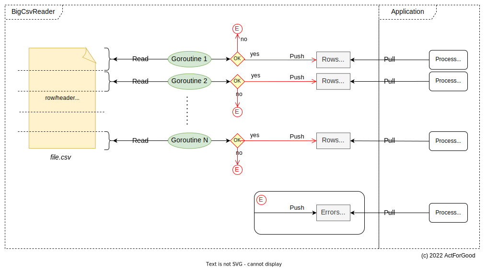

# BigCsvReader

[](https://github.com/actforgood/bigcsvreader/actions/workflows/build.yml)
[](https://raw.githubusercontent.com/actforgood/bigcsvreader/main/LICENSE)
[](https://coveralls.io/github/actforgood/bigcsvreader?branch=main)
[](https://pkg.go.dev/github.com/actforgood/bigcsvreader)  

---  

Package `bigcscvreader` offers a multi-threaded approach for reading a large CSV file in order to improve the time of reading and processing it.  
It spawns multiple goroutines, each reading a piece of the file.  
Read rows are put into channels equal in number to the spawned goroutines, in this way also the processing of those rows can be parallelized.  


### Installation

```shell
$ go get -u github.com/actforgood/bigcsvreader
```

### Example

Please refer to this [example](https://pkg.go.dev/github.com/actforgood/bigcsvreader#example-CsvReader).


### How it is designed to work



### Benchmarks
```
go test -timeout=20m -benchmem -benchtime=2x -bench=.
goos: darwin
goarch: amd64
pkg: github.com/actforgood/bigcsvreader
cpu: Intel(R) Core(TM) i7-7700HQ CPU @ 2.80GHz
Benchmark50000Rows_50Mb_withBigCsvReader-8                                     2        8030321166 ns/op        61739968 B/op     100219 allocs/op
Benchmark50000Rows_50Mb_withGoCsvReaderReadAll-8                               2        65555449418 ns/op       67438460 B/op     100040 allocs/op
Benchmark50000Rows_50Mb_withGoCsvReaderReadOneByOneAndReuseRecord-8            2        66464272707 ns/op       57605856 B/op      50014 allocs/op
```

Benchmarks are made with a file of ~`50Mb` in size, also a fake processing of any given row of `1ms` was taken into consideration.  
bigcsvreader was launched with `8` goroutines.  
Other benchmarks are made using directly the `encoding/csv` go package.  
As you can see, bigcsvreader reads and processes all rows in ~`8s`.  
Go standard csv package reads and processes all rows in ~`65s`.  
`ReadAll` API has the disadvantage of keeping all rows into memory.  
`Read` rows one by one API with `ReuseRecord` flag set has the advantage of fewer allocations, but has the cost of sequentially reading rows.  

Bellow are some process stats captured with unix `TOP` command while running each benchmark.
| Bench | %CPU | MEM |
| --- | --- | --- |
| Benchmark50000Rows_50Mb_withBigCsvReader | 21.6 | 8156K |
| Benchmark50000Rows_50Mb_withGoCsvReaderReadAll | 5.3 | 67M |
| Benchmark50000Rows_50Mb_withGoCsvReaderReadOneByOneAndReuseRecord | 10.1 | 5704K |


### License
This package is released under a MIT license. See [LICENSE](LICENSE).  
